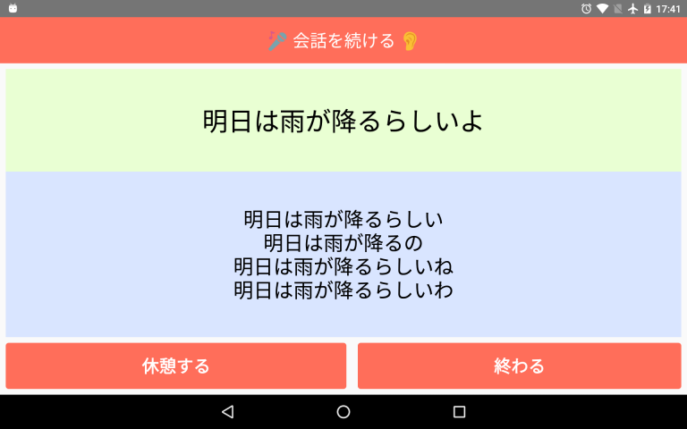

# ReadLikeTalking

聴力が落ちてきた人との会話を支援するAndroidアプリ(開発中)です。

会話は、こんな流れで進みます。

1. あなたが話す
2. 音声認識されて画面に表示される
3. 相手が、それを読み、返事する
4. 1へ戻る

認識結果に複数の候補がある場合は、第一候補を上段に表示し、第二候補以降を下段に表示します。

「会話を続ける」をタッチすると1へ戻ります。

# テクニカルな要素

- ClojureScript
- re-natal
- Figwheel
- nREPL & Piggieback
- Vim (+ vim-fireplace)
- re-frame
- Reagent
- Android Speech Recognizer
- react-native-voice
- ReactJS
- React Native

# 開発

## Terminal1

    $ adb reverse tcp:8081 tcp:8081
    $ adb reverse tcp:3449 tcp:3449
    $ re-natal use-android-device real
    $ re-natal use-figwheel
    $ lein repl
    user=> (start-figwheel "android")

## Terminal2

    $ react-native run-android

## Terminal3

    $ react-native log-android

## Terminal4

    $ vim src/read-like-talking/android/core.cljs
    :CljEval (cider.piggieback/cljs-repl (figwheel-sidecar.repl-api/repl-env))

## TODO

- 「1へ戻る」を自動化したい
- 音声認識APIのパラメータ調整

# パッケージング

T.B.D
